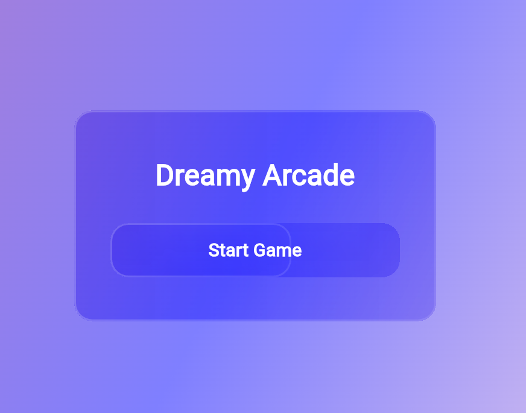
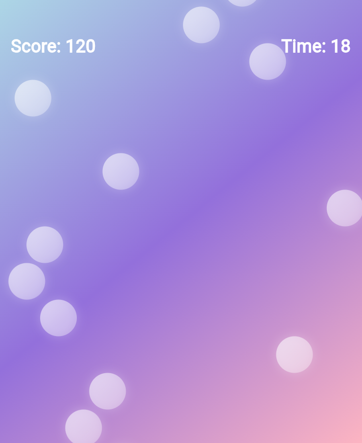
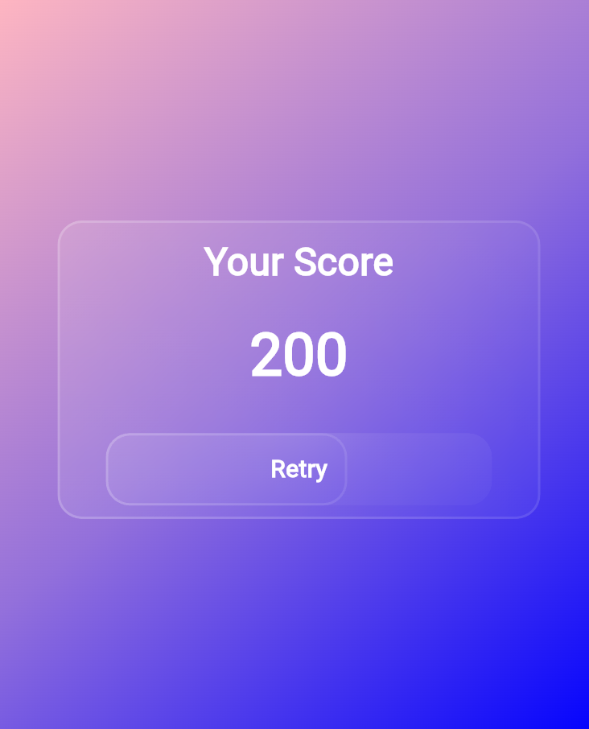

# About

- An arcade style game built with flutter have to pop as many bubbles within the time limit

# Built With
- Flutter
- Dart
- glassmorphism package
- google_fonts package

## Getting Started

1. Clone the repository
git clone https://github.com/desireedagondon000-gif/dreamy_arcade.git
cd dreamy_arcade
2. Install dependencies
flutter pub get
3. Run the app
flutter run

# Screens

# Home Screen
- Start the game
- Clean glassmorphic UI

# Game Screen
- Tap bubbles to score points
- Timer counts down from 30 seconds

# Score Screen
- Displays final score
- Retry button to restart game

